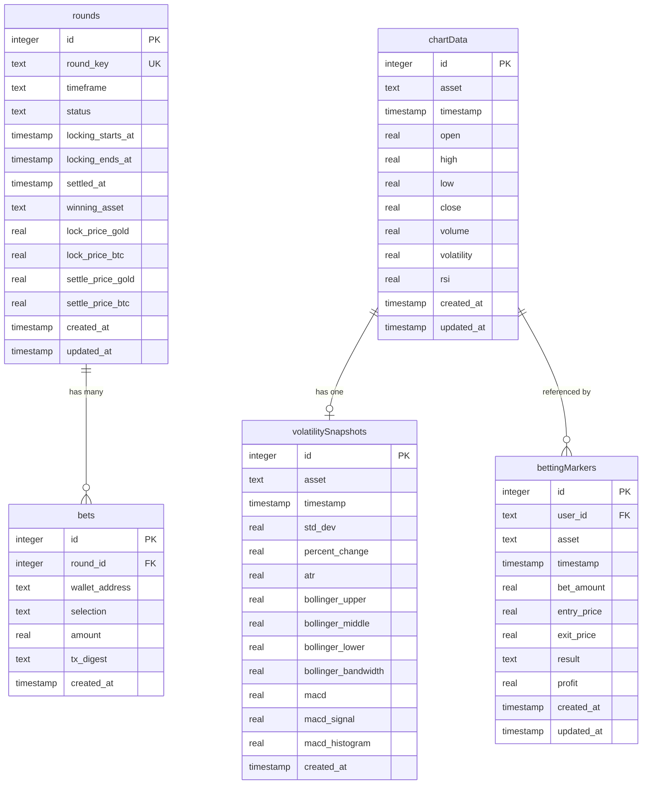
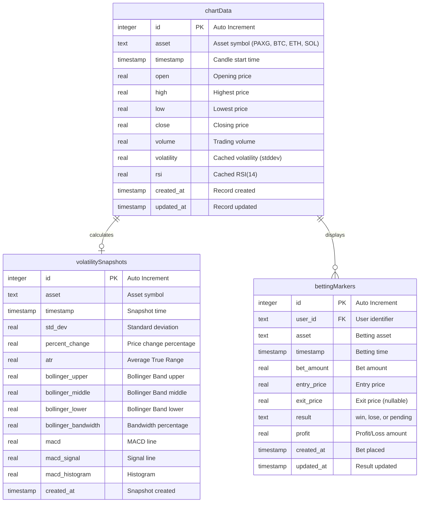
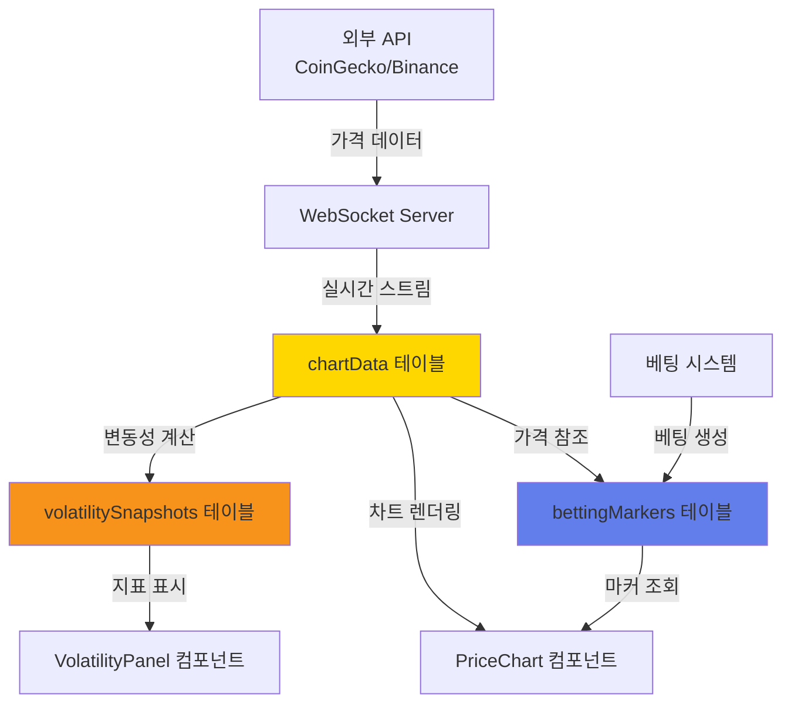

# 차트 모듈 ERD 다이어그램

**작성자**: 김현준
**작성일**: 2025-11-11
**데이터베이스**: SQLite (Cloudflare D1)
**ORM**: Drizzle

---

## 🗄️ 전체 ERD



---

## 📊 차트 모듈 상세 ERD



---

## 🔗 테이블 관계 설명

### 1. chartData → volatilitySnapshots (1:1)
- **관계**: 하나의 차트 데이터는 하나의 변동성 스냅샷을 가짐
- **조건**: `(asset, timestamp)` 복합 키로 연결
- **용도**: 변동성 지표 계산 결과 캐싱

```typescript
// Drizzle 관계 정의
export const chartDataRelations = relations(chartData, ({ one }) => ({
  volatilitySnapshot: one(volatilitySnapshots, {
    fields: [chartData.asset, chartData.timestamp],
    references: [volatilitySnapshots.asset, volatilitySnapshots.timestamp],
  }),
}));
```

### 2. chartData → bettingMarkers (1:N)
- **관계**: 하나의 차트 데이터는 여러 베팅 마커를 가질 수 있음
- **조건**: `(asset, timestamp)` 복합 키로 연결
- **용도**: 차트 위에 사용자 베팅 표시

```typescript
export const bettingMarkersRelations = relations(bettingMarkers, ({ one }) => ({
  chartData: one(chartData, {
    fields: [bettingMarkers.asset, bettingMarkers.timestamp],
    references: [chartData.asset, chartData.timestamp],
  }),
}));
```

---

## 🎯 인덱스 전략

### chartData 테이블
```sql
-- 복합 Primary Key (asset, timestamp)
PRIMARY KEY (asset, timestamp)

-- 이유:
-- 1. 특정 자산의 시간대별 조회가 가장 빈번
-- 2. 동일 자산의 동일 시간대 데이터 중복 방지
-- 3. 범위 조회(range query) 성능 최적화
```

**예상 쿼리**:
```sql
-- 24시간 데이터 조회 (인덱스 활용)
SELECT * FROM chart_data
WHERE asset = 'BTC'
  AND timestamp >= datetime('now', '-24 hours')
ORDER BY timestamp ASC;

-- 최신 가격 조회 (인덱스 활용)
SELECT * FROM chart_data
WHERE asset = 'PAXG'
ORDER BY timestamp DESC
LIMIT 1;
```

### volatilitySnapshots 테이블
```sql
-- 복합 Primary Key (asset, timestamp)
PRIMARY KEY (asset, timestamp)
```

### bettingMarkers 테이블
```sql
-- Primary Key: id
-- 추가 인덱스 필요:
CREATE INDEX idx_betting_markers_user_asset
ON betting_markers(user_id, asset);

CREATE INDEX idx_betting_markers_timestamp
ON betting_markers(timestamp);
```

---

## 📐 데이터 흐름도



---

## 🔢 데이터 볼륨 예측

### chartData
- **1분 캔들**: 1,440개/일/자산
- **지원 자산**: 4개 (PAXG, BTC, ETH, SOL)
- **보관 기간**: 90일
- **예상 레코드**: 1,440 × 4 × 90 = **518,400개**
- **예상 용량**: ~50MB (SQLite)

### volatilitySnapshots
- **계산 주기**: 1분마다
- **보관 기간**: 30일
- **예상 레코드**: 1,440 × 4 × 30 = **172,800개**
- **예상 용량**: ~25MB

### bettingMarkers
- **예상 베팅**: 100개/일 (초기)
- **보관 기간**: 영구
- **예상 레코드 (1년)**: 100 × 365 = **36,500개**
- **예상 용량**: ~5MB

**총 예상 용량**: ~80MB (1년 기준)

---

## 🗑️ 데이터 정리 전략

### 자동 정리 (Cron Job)

```typescript
// scripts/cleanup-old-data.ts

import { db } from '@/db/client';
import { chartData, volatilitySnapshots } from '@/db/schema';
import { lt } from 'drizzle-orm';

export async function cleanupOldChartData() {
  const ninetyDaysAgo = new Date(Date.now() - 90 * 24 * 60 * 60 * 1000);

  // chartData 90일 이상 오래된 데이터 삭제
  await db.delete(chartData)
    .where(lt(chartData.timestamp, ninetyDaysAgo));

  console.log('✅ Chart data older than 90 days deleted');
}

export async function cleanupOldVolatilitySnapshots() {
  const thirtyDaysAgo = new Date(Date.now() - 30 * 24 * 60 * 60 * 1000);

  // volatilitySnapshots 30일 이상 오래된 데이터 삭제
  await db.delete(volatilitySnapshots)
    .where(lt(volatilitySnapshots.timestamp, thirtyDaysAgo));

  console.log('✅ Volatility snapshots older than 30 days deleted');
}

// 매일 자정 실행
// Cron: 0 0 * * *
```

---

## 🧪 샘플 데이터

### chartData 샘플

```sql
INSERT INTO chart_data (asset, timestamp, open, high, low, close, volume, volatility, rsi)
VALUES
  ('PAXG', 1699776000000, 2650.50, 2655.00, 2648.00, 2652.30, 125000.00, 2.45, 58.3),
  ('BTC', 1699776000000, 45000.00, 45500.00, 44800.00, 45200.00, 2500000.00, 250.75, 62.1),
  ('ETH', 1699776000000, 3100.00, 3120.00, 3095.00, 3110.00, 1200000.00, 45.30, 55.7),
  ('SOL', 1699776000000, 95.50, 96.20, 95.00, 95.80, 500000.00, 2.15, 52.4);
```

### volatilitySnapshots 샘플

```sql
INSERT INTO volatility_snapshots (asset, timestamp, std_dev, percent_change, atr, bollinger_upper, bollinger_middle, bollinger_lower)
VALUES
  ('PAXG', 1699776000000, 2.45, 0.07, 3.20, 2680.00, 2650.00, 2620.00),
  ('BTC', 1699776000000, 250.75, -1.23, 380.50, 46500.00, 45000.00, 43500.00);
```

### bettingMarkers 샘플

```sql
INSERT INTO betting_markers (user_id, asset, timestamp, bet_amount, entry_price, exit_price, result, profit)
VALUES
  ('user123', 'PAXG', 1699776000000, 1000.00, 2650.30, 2680.50, 'win', 30.20),
  ('user456', 'BTC', 1699776060000, 500.00, 45200.00, 44800.00, 'lose', -400.00),
  ('user789', 'ETH', 1699776120000, 750.00, 3110.00, NULL, 'pending', NULL);
```

---

## 🔐 데이터 무결성 제약

### 비즈니스 로직 제약

```typescript
// lib/validators/chart.ts

import { z } from 'zod';

export const assetSchema = z.enum(['PAXG', 'BTC', 'ETH', 'SOL']);

export const chartDataSchema = z.object({
  asset: assetSchema,
  timestamp: z.date(),
  open: z.number().positive(),
  high: z.number().positive(),
  low: z.number().positive(),
  close: z.number().positive(),
  volume: z.number().nonnegative(),
}).refine(data => {
  // OHLC 무결성 검증
  return data.high >= data.open &&
         data.high >= data.close &&
         data.low <= data.open &&
         data.low <= data.close;
}, {
  message: 'Invalid OHLC: high must be >= open/close, low must be <= open/close'
});

export const bettingMarkerSchema = z.object({
  userId: z.string().min(1),
  asset: assetSchema,
  betAmount: z.number().positive(),
  entryPrice: z.number().positive(),
  result: z.enum(['win', 'lose', 'pending']).optional(),
});
```

---

## 📝 마이그레이션 가이드

### 1. 스키마 생성

```bash
# Drizzle 마이그레이션 생성
npm run db:generate

# 출력: drizzle/0001_add_chart_tables.sql
```

### 2. 마이그레이션 적용

```bash
# 로컬 개발
npm run db:migrate

# 프로덕션 (Cloudflare D1)
npx wrangler d1 migrations apply deltax-db --remote
```

### 3. 스키마 검증

```bash
# Drizzle Studio로 스키마 확인
npm run db:studio
```

---

## 🔄 버전 관리

| 버전 | 날짜 | 변경 내용 | 작성자 |
|------|------|-----------|--------|
| 1.0 | 2025-11-11 | 초기 스키마 생성 | 김현준 |

---

**문서 상태**: ✅ 완료
**스키마 적용**: ⏳ 대기 중
**팀 리뷰**: ⏳ 대기 중
