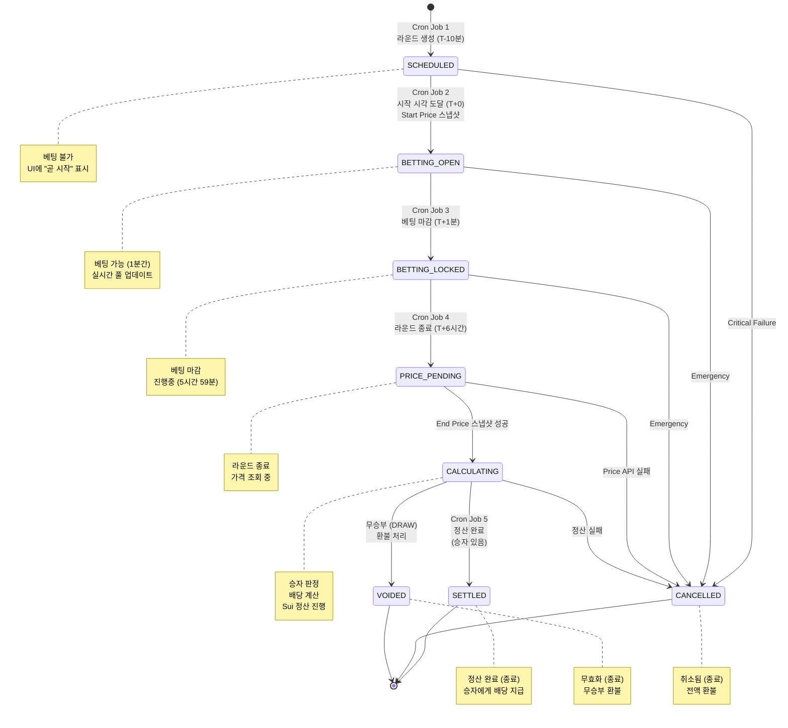
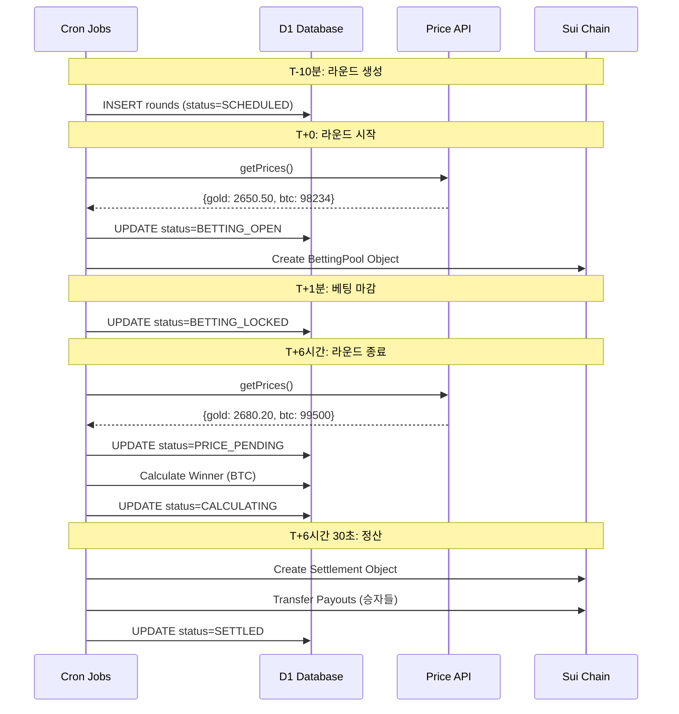

# 라운드 상태 전이 머신 (Round FSM) 완전 명세

## 📋 목차

1. [개요](#개요)
2. [상태 정의](#상태-정의)
3. [전이 규칙](#전이-규칙)
4. [상태별 상세 명세](#상태별-상세-명세)
5. [Edge Cases & 예외 처리](#edge-cases--예외-처리)
6. [상태 전이 검증](#상태-전이-검증)
7. [Mermaid 다이어그램](#mermaid-다이어그램)

---

## 개요

deltaX의 6시간 라운드는 **7개의 명확한 상태**를 가진 FSM(Finite State Machine)으로 관리됩니다.

### 핵심 원칙

1. **단방향성**: 정상 플로우는 항상 앞으로만 진행 (SCHEDULED → SETTLED)
2. **멱등성**: 같은 전이를 여러 번 실행해도 결과 동일
3. **원자성**: 상태 전이는 트랜잭션 단위로 처리
4. **감사성**: 모든 전이는 타임스탬프 기록

### 라운드 생명주기 요약

```
생성 (T-10분) → 시작 (T+0) → 베팅마감 (T+1분) → 진행 (T+6시간) → 정산 (T+6시간 30초) → 완료
```

---

## 상태 정의

### State Enum

```typescript
enum RoundStatus {
  SCHEDULED = 'SCHEDULED', // 생성됨, 대기중
  BETTING_OPEN = 'BETTING_OPEN', // 베팅 가능
  BETTING_LOCKED = 'BETTING_LOCKED', // 베팅 마감, 진행중
  PRICE_PENDING = 'PRICE_PENDING', // 종료, 가격 대기
  CALCULATING = 'CALCULATING', // 승자 판정 + 배당 계산
  SETTLED = 'SETTLED', // 정산 완료 (종료)
  CANCELLED = 'CANCELLED', // 취소됨 (종료)
  VOIDED = 'VOIDED', // 무효화 (종료)
}
```

### 상태 분류

| 분류          | 상태                                                                | 설명               |
| ------------- | ------------------------------------------------------------------- | ------------------ |
| **진행중**    | SCHEDULED, BETTING_OPEN, BETTING_LOCKED, PRICE_PENDING, CALCULATING | 전이 가능          |
| **종료**      | SETTLED, CANCELLED, VOIDED                                          | 더 이상 전이 불가  |
| **베팅 가능** | BETTING_OPEN                                                        | 유일하게 베팅 허용 |
| **정산 대상** | CALCULATING                                                         | 유일하게 정산 진행 |

---

## 전이 규칙

### 허용된 전이 (Allowed Transitions)

```typescript
const ALLOWED_TRANSITIONS: Record<RoundStatus, RoundStatus[]> = {
  // 진행 상태 → 다음 단계 or 취소
  SCHEDULED: ['BETTING_OPEN', 'CANCELLED'],
  BETTING_OPEN: ['BETTING_LOCKED', 'CANCELLED'],
  BETTING_LOCKED: ['PRICE_PENDING', 'CANCELLED'],
  PRICE_PENDING: ['CALCULATING', 'CANCELLED'],
  CALCULATING: ['SETTLED', 'VOIDED', 'CANCELLED'],

  // 종료 상태 → 전이 불가
  SETTLED: [],
  CANCELLED: [],
  VOIDED: [],
};
```

### 전이 트리거 (Transition Triggers)

| From           | To             | Trigger               | Actor        |
| -------------- | -------------- | --------------------- | ------------ |
| SCHEDULED      | BETTING_OPEN   | 라운드 시작 시각 도달 | Cron Job 2   |
| BETTING_OPEN   | BETTING_LOCKED | 시작 +1분 경과        | Cron Job 3   |
| BETTING_LOCKED | PRICE_PENDING  | 시작 +6시간 경과      | Cron Job 4   |
| PRICE_PENDING  | CALCULATING    | End Price 스냅샷 성공 | Cron Job 4   |
| CALCULATING    | SETTLED        | 정산 완료             | Cron Job 5   |
| CALCULATING    | VOIDED         | 무승부 발생           | Cron Job 5   |
| \*             | CANCELLED      | Critical Failure      | Admin/System |

### 전이 금지 (Invalid Transitions)

```typescript
// 예시: 잘못된 전이 시도
BETTING_LOCKED → BETTING_OPEN  ❌  // 역방향 불가
SETTLED → CALCULATING          ❌  // 종료 상태에서 전이 불가
SCHEDULED → CALCULATING        ❌  // 단계 건너뛰기 불가
```

---

## 상태별 상세 명세

### 1. SCHEDULED (예약됨)

**진입 조건:**

- Cron Job 1이 새 라운드 생성 시
- 라운드 시작 10분 전

**상태 특성:**

- 베팅 불가
- UI에 "곧 시작" 표시
- 유저가 라운드 정보 미리 확인 가능

**DB 필드 상태:**

```typescript
{
  status: 'SCHEDULED',
  start_time: T+10분 후,
  end_time: T+6시간 10분 후,
  lock_time: T+11분 후,  // 베팅 마감 시각

  // 가격 정보 없음
  gold_start_price: null,
  gold_end_price: null,
  btc_start_price: null,
  btc_end_price: null,

  // 베팅 정보 없음
  total_pool: 0,
  total_gold_bets: 0,
  total_btc_bets: 0,

  winner: null,
  sui_pool_address: null,  // 아직 Sui Object 생성 안 됨

  created_at: CURRENT_TIMESTAMP,
  updated_at: CURRENT_TIMESTAMP
}
```

**가능한 액션:**

- ✅ 라운드 정보 조회 (GET /api/rounds/:id)
- ✅ 취소 (Admin 권한)
- ❌ 베팅 불가

**다음 상태:**

- ✅ `BETTING_OPEN` (정상 플로우)
- ✅ `CANCELLED` (Critical Failure)

---

### 2. BETTING_OPEN (베팅 가능)

**진입 조건:**

- Cron Job 2가 라운드 시작 시각에 실행
- Start Price 스냅샷 성공

**상태 특성:**

- **베팅 가능** (유일)
- 유지 시간: 정확히 1분
- WebSocket 실시간 베팅 현황 브로드캐스트

**DB 필드 상태:**

```typescript
{
  status: 'BETTING_OPEN',

  // Start Price 기록됨
  gold_start_price: "2650.50",  // decimal as text
  btc_start_price: "98234.00",
  price_snapshot_start_at: "2025-11-15T05:00:00.500Z",

  // 베팅 정보 실시간 업데이트
  total_pool: 500000,  // 베팅 누적
  total_gold_bets: 300000,
  total_btc_bets: 200000,

  // 아직 종료 안 됨
  gold_end_price: null,
  btc_end_price: null,
  winner: null,

  // Sui Object 생성됨
  sui_pool_address: "0x123abc...",  // BettingPool Object ID

  betting_opened_at: CURRENT_TIMESTAMP,
  updated_at: CURRENT_TIMESTAMP (매 베팅마다)
}
```

**가능한 액션:**

- ✅ 베팅 (POST /api/bets)
- ✅ 현재 풀 조회 (GET /api/rounds/:id)
- ✅ 실시간 베팅 현황 (WebSocket)
- ❌ 정산 불가

**베팅 가능 조건 검증:**

```typescript
// API에서 베팅 요청 시 검증
function canPlaceBet(round: Round): boolean {
  // 1. 상태 확인
  if (round.status !== 'BETTING_OPEN') return false;

  // 2. 시간 확인 (Hard Lock)
  const now = new Date();
  if (now >= round.lock_time) return false;

  // 3. Grace Period (클라이언트 지연 고려)
  const gracePeriod = 5000; // 5초
  const effectiveLockTime = new Date(round.lock_time.getTime() - gracePeriod);
  if (now >= effectiveLockTime) {
    // 경고: 곧 마감됨
    console.warn('Bet placed near lock time');
  }

  return true;
}
```

**다음 상태:**

- ✅ `BETTING_LOCKED` (1분 경과)
- ✅ `CANCELLED` (Emergency)

---

### 3. BETTING_LOCKED (베팅 마감)

**진입 조건:**

- Cron Job 3이 시작 +1분에 실행
- 또는 lock_time 도달

**상태 특성:**

- 베팅 완전 불가
- 라운드 진행중 (5시간 59분 대기)
- 유저는 결과만 기다림

**DB 필드 상태:**

```typescript
{
  status: 'BETTING_LOCKED',

  // Start Price (변경 없음)
  gold_start_price: "2650.50",
  btc_start_price: "98234.00",

  // 최종 베팅 풀 (더 이상 변경 안 됨)
  total_pool: 1500000,
  total_gold_bets: 800000,
  total_btc_bets: 700000,

  // 아직 종료 안 됨
  gold_end_price: null,
  btc_end_price: null,
  winner: null,

  betting_locked_at: CURRENT_TIMESTAMP,
  updated_at: CURRENT_TIMESTAMP
}
```

**가능한 액션:**

- ✅ 라운드 정보 조회 (읽기 전용)
- ✅ 베팅 기록 조회 (GET /api/bets?roundId=...)
- ❌ 베팅 불가
- ❌ 정산 불가

**다음 상태:**

- ✅ `PRICE_PENDING` (6시간 경과)
- ✅ `CANCELLED` (Emergency)

---

### 4. PRICE_PENDING (가격 대기)

**진입 조건:**

- Cron Job 4가 종료 시각에 실행
- End Price 스냅샷 시도 중

**상태 특성:**

- 라운드 종료됨
- End Price 조회 중
- 짧은 대기 상태 (수 초)

**DB 필드 상태:**

```typescript
{
  status: 'PRICE_PENDING',

  // Start Price (변경 없음)
  gold_start_price: "2650.50",
  btc_start_price: "98234.00",

  // End Price 조회 시도중
  gold_end_price: null,  // 아직 없음
  btc_end_price: null,
  price_snapshot_end_at: null,  // 곧 기록됨

  // 베팅 풀 (변경 없음)
  total_pool: 1500000,
  total_gold_bets: 800000,
  total_btc_bets: 700000,

  round_ended_at: CURRENT_TIMESTAMP,
  updated_at: CURRENT_TIMESTAMP
}
```

**가능한 액션:**

- ✅ 라운드 정보 조회
- ❌ 베팅 불가
- ❌ 정산 불가 (아직)

**전이 시나리오:**

**시나리오 A: 정상 (가격 스냅샷 성공)**

```
1. getPrices() 호출
2. 성공: { gold: 2680.20, btc: 99500.00 }
3. DB 업데이트:
   - gold_end_price = "2680.20"
   - btc_end_price = "99500.00"
   - price_snapshot_end_at = "2025-11-15T11:00:01Z"
4. 상태 전이: PRICE_PENDING → CALCULATING
```

**시나리오 B: 실패 (가격 API 타임아웃)**

```
1. getPrices() 호출
2. 타임아웃 (5초 초과)
3. Fallback:
   a. Redis 캐시 확인
   b. 최근 10분 이내 가격 있으면 사용
   c. 없으면 → CANCELLED
4. 상태 전이:
   - 성공 시: PRICE_PENDING → CALCULATING
   - 실패 시: PRICE_PENDING → CANCELLED
```

**다음 상태:**

- ✅ `CALCULATING` (가격 확보 성공)
- ✅ `CANCELLED` (가격 확보 실패)

---

### 5. CALCULATING (정산 계산중)

**진입 조건:**

- End Price 스냅샷 성공
- 승자 판정 시작

**상태 특성:**

- 승자 결정
- 배당 계산
- Sui 정산 트랜잭션 준비/전송

**DB 필드 상태:**

```typescript
{
  status: 'CALCULATING',

  // 모든 가격 확정
  gold_start_price: "2650.50",
  btc_start_price: "98234.00",
  gold_end_price: "2680.20",
  btc_end_price: "99500.00",

  // 승자 판정 완료
  winner: "GOLD",  // or "BTC" or "DRAW"

  // 변동률 계산 결과
  gold_change_percent: "1.12",  // (2680.20 - 2650.50) / 2650.50 = 0.0112
  btc_change_percent: "1.29",   // (99500 - 98234) / 98234 = 0.0129

  // 베팅 풀 (변경 없음)
  total_pool: 1500000,
  total_gold_bets: 800000,
  total_btc_bets: 700000,

  // 배당 계산
  platform_fee: 75000,          // total_pool * 0.05
  payout_pool: 1425000,         // total_pool - platform_fee
  payout_ratio: "2.0357",       // payout_pool / total_btc_bets (BTC가 승리)

  settlement_started_at: CURRENT_TIMESTAMP,
  updated_at: CURRENT_TIMESTAMP
}
```

**승자 판정 로직:**

```typescript
// 변동률 계산
const goldChange = (gold_end - gold_start) / gold_start;
const btcChange = (btc_end - btc_start) / btc_start;

// 승자 결정
if (Math.abs(goldChange - btcChange) < 0.0001) {
  // 무승부: 0.01% 이내 차이 (예: 1.120% vs 1.121%)
  winner = 'DRAW';
  next_status = 'VOIDED';
} else if (goldChange > btcChange) {
  winner = 'GOLD';
  next_status = 'SETTLED';
} else {
  winner = 'BTC';
  next_status = 'SETTLED';
}
```

**배당 계산 로직:**

```typescript
// 수수료 차감
const platformFee = total_pool * 0.05;
const payoutPool = total_pool - platformFee;

// 승자 풀 결정
const winningPool = winner === 'GOLD' ? total_gold_bets : total_btc_bets;

// 개별 배당 계산
for (const bet of winningBets) {
  const userShare = bet.amount / winningPool;
  const payout = userShare * payoutPool;

  // 소수점 처리 (DEL은 정수)
  bet.payout = Math.floor(payout);
}

// 배당 비율 (참고용)
const payoutRatio = payoutPool / winningPool;
// 예: 1425000 / 700000 = 2.0357
// → 1 DEL 베팅 당 2.0357 DEL 수령
```

**가능한 액션:**

- ✅ 라운드 정보 조회
- ✅ 정산 진행 상태 모니터링
- ❌ 베팅 불가
- ❌ 재정산 불가 (한 번만)

**전이 시나리오:**

**시나리오 A: 정상 정산 (승자 있음)**

```
1. 승자 판정: GOLD or BTC
2. 배당 계산
3. Sui Settlement Object 생성
4. 각 승자에게 Sui Payout 전송
5. DB 업데이트:
   - bets.settlement_status = 'COMPLETED'
   - bets.result_status = 'WON' / 'LOST'
   - bets.payout = calculated_amount
   - rounds.status = 'SETTLED'
```

**시나리오 B: 무승부**

```
1. 승자 판정: DRAW
2. 전액 환불 계산 (수수료 없음)
3. 각 베팅자에게 원금 반환
4. DB 업데이트:
   - bets.settlement_status = 'COMPLETED'
   - bets.result_status = 'REFUNDED'
   - bets.payout = bet.amount (원금)
   - rounds.status = 'VOIDED'
   - rounds.void_reason = 'DRAW'
```

**시나리오 C: 정산 실패 (Sui 트랜잭션 실패)**

```
1. 승자 판정 완료
2. Sui Payout 전송 시도
3. 실패 (네트워크 오류 등)
4. 재시도 로직:
   - settlement_retry_count 증가
   - 3회까지 재시도
   - 모두 실패 시 → CANCELLED + 수동 개입 알림
```

**다음 상태:**

- ✅ `SETTLED` (정산 성공)
- ✅ `VOIDED` (무승부)
- ✅ `CANCELLED` (정산 실패)

---

### 6. SETTLED (정산 완료)

**진입 조건:**

- 모든 승자에게 배당 지급 완료
- Sui 트랜잭션 모두 성공

**상태 특성:**

- **종료 상태** (더 이상 전이 불가)
- 모든 정산 완료
- 영구 기록

**DB 필드 상태:**

```typescript
{
  status: 'SETTLED',

  // 완전한 가격 기록
  gold_start_price: "2650.50",
  btc_start_price: "98234.00",
  gold_end_price: "2680.20",
  btc_end_price: "99500.00",

  // 확정된 승자
  winner: "BTC",

  // 최종 베팅 풀
  total_pool: 1500000,
  total_gold_bets: 800000,
  total_btc_bets: 700000,

  // 정산 정보
  platform_fee: 75000,
  payout_pool: 1425000,
  total_winners: 45,  // 승자 수

  // Sui 기록
  sui_settlement_object_id: "0xabc123...",

  // 타임스탬프
  settlement_completed_at: CURRENT_TIMESTAMP,
  updated_at: CURRENT_TIMESTAMP
}
```

**가능한 액션:**

- ✅ 라운드 결과 조회
- ✅ 베팅 기록 조회
- ✅ 정산 내역 조회
- ✅ Sui Explorer 확인 (투명성)
- ❌ 수정 불가 (Immutable)

**다음 상태:**

- ❌ 없음 (종료 상태)

---

### 7. CANCELLED (취소됨)

**진입 조건:**

- Critical Failure 발생
- Admin 수동 취소
- 가격 API 연속 실패

**상태 특성:**

- **종료 상태** (더 이상 전이 불가)
- 모든 베팅 환불
- 이유 기록 필수

**DB 필드 상태:**

```typescript
{
  status: 'CANCELLED',

  // 가격 정보 (일부만 있을 수 있음)
  gold_start_price: "2650.50",  // or null
  btc_start_price: "98234.00",  // or null
  gold_end_price: null,         // 종료 전 취소 시
  btc_end_price: null,

  // 베팅 풀 (취소 시점까지)
  total_pool: 500000,
  total_gold_bets: 300000,
  total_btc_bets: 200000,

  winner: null,

  // 취소 정보
  cancellation_reason: "PRICE_API_FAILURE",  // 이유 코드
  cancellation_message: "가격 API 연속 3회 실패",
  cancelled_by: "SYSTEM",  // or "ADMIN"
  cancelled_at: CURRENT_TIMESTAMP,

  // 환불 정보
  refund_completed: true,
  refund_count: 23,  // 환불 대상 베팅 수

  updated_at: CURRENT_TIMESTAMP
}
```

**취소 사유 코드:**

```typescript
enum CancellationReason {
  PRICE_API_FAILURE = 'PRICE_API_FAILURE', // 가격 조회 실패
  INSUFFICIENT_BETS = 'INSUFFICIENT_BETS', // 최소 베팅 미달
  SYSTEM_ERROR = 'SYSTEM_ERROR', // 시스템 오류
  ADMIN_DECISION = 'ADMIN_DECISION', // 관리자 결정
  SUI_NETWORK_ERROR = 'SUI_NETWORK_ERROR', // Sui 네트워크 오류
  DUPLICATE_ROUND = 'DUPLICATE_ROUND', // 중복 라운드 생성
  OTHER = 'OTHER', // 기타
}
```

**환불 처리:**

```typescript
// 취소 시 모든 베팅 환불
for (const bet of allBets) {
  // Sui Unlock 트랜잭션
  await unlockBet(bet.sui_bet_object_id, bet.user_address, bet.amount);

  // DB 업데이트
  await db
    .update(bets)
    .set({
      settlement_status: 'COMPLETED',
      result_status: 'REFUNDED',
      payout: bet.amount, // 원금 반환
      refunded_at: new Date(),
    })
    .where(eq(bets.id, bet.id));
}
```

**가능한 액션:**

- ✅ 라운드 정보 조회
- ✅ 취소 사유 확인
- ✅ 환불 내역 확인
- ❌ 재시작 불가

**다음 상태:**

- ❌ 없음 (종료 상태)

---

### 8. VOIDED (무효화)

**진입 조건:**

- 무승부 발생 (DRAW)
- 변동률 차이 < 0.01%

**상태 특성:**

- **종료 상태** (더 이상 전이 불가)
- 전액 환불 (수수료 없음)
- 무승부 기록

**DB 필드 상태:**

```typescript
{
  status: 'VOIDED',

  // 완전한 가격 기록
  gold_start_price: "2650.50",
  btc_start_price: "98234.00",
  gold_end_price: "2677.30",
  btc_end_price: "99357.00",

  // 무승부
  winner: 'DRAW',

  // 변동률 (거의 동일)
  gold_change_percent: "1.011",  // 1.011%
  btc_change_percent: "1.012",   // 1.012%
  change_diff_percent: "0.001",  // 차이 0.001%

  // 베팅 풀
  total_pool: 1500000,
  total_gold_bets: 800000,
  total_btc_bets: 700000,

  // 무효 정보
  void_reason: 'DRAW',
  void_threshold: "0.0001",  // 0.01% 기준

  // 환불 정보
  refund_completed: true,
  refund_count: 68,  // 전체 베팅 수

  voided_at: CURRENT_TIMESTAMP,
  updated_at: CURRENT_TIMESTAMP
}
```

**무승부 판정 기준:**

```typescript
// 변동률 계산
const goldChange = (gold_end - gold_start) / gold_start;
const btcChange = (btc_end - btc_start) / btc_start;

// 차이 계산
const diff = Math.abs(goldChange - btcChange);

// 무승부 기준: 0.01% (0.0001)
const DRAW_THRESHOLD = 0.0001;

if (diff < DRAW_THRESHOLD) {
  // 무승부
  winner = 'DRAW';
  void_reason = 'DRAW';
  status = 'VOIDED';
}

// 예시:
// Gold: 1.0112% 상승
// BTC:  1.0118% 상승
// 차이: 0.0006% < 0.01%
// → 무승부
```

**환불 처리 (수수료 없음):**

```typescript
// 무승부 시 원금 100% 환불
for (const bet of allBets) {
  await unlockBet(bet.sui_bet_object_id, bet.user_address, bet.amount);

  await db
    .update(bets)
    .set({
      settlement_status: 'COMPLETED',
      result_status: 'REFUNDED',
      payout: bet.amount, // 원금 그대로
      refunded_at: new Date(),
    })
    .where(eq(bets.id, bet.id));
}

// 플랫폼 수수료 없음!
```

**가능한 액션:**

- ✅ 라운드 결과 조회
- ✅ 무승부 사유 확인
- ✅ 환불 내역 확인
- ❌ 재시작 불가

**다음 상태:**

- ❌ 없음 (종료 상태)

---

## Edge Cases & 예외 처리

### 1. 동시 상태 전이 시도

**문제:**

```
Cron Job 2가 SCHEDULED → BETTING_OPEN 전이 시도 중
동시에 Admin이 SCHEDULED → CANCELLED 시도

→ Race Condition
```

**해결:**

```typescript
// 트랜잭션 + 낙관적 잠금 (Optimistic Locking)
await db.transaction(async (tx) => {
  // 1. 현재 상태 확인
  const round = await tx.select().from(rounds).where(eq(rounds.id, roundId)).for('update'); // Row Lock

  // 2. 전이 가능 여부 검증
  if (!canTransition(round.status, newStatus)) {
    throw new Error(`Invalid transition: ${round.status} → ${newStatus}`);
  }

  // 3. 상태 업데이트
  await tx
    .update(rounds)
    .set({
      status: newStatus,
      updated_at: new Date(),
    })
    .where(
      and(
        eq(rounds.id, roundId),
        eq(rounds.status, round.status), // 낙관적 잠금
      ),
    );
});
```

### 2. Cron Job 실행 지연

**문제:**

```
예정 실행: 14:00:00
실제 실행: 14:00:05 (5초 지연)

→ 베팅 마감 시각도 5초 늦어짐?
```

**해결:**

```typescript
// 절대 시각 기준, 상대 시각 아님
const lockTime = new Date(startTime.getTime() + 60 * 1000); // 시작 +1분

// Cron Job에서
if (now >= round.lock_time && round.status === 'BETTING_OPEN') {
  // 즉시 마감 (지연 시간 무관)
  await transitionTo(round, 'BETTING_LOCKED');
}
```

### 3. 가격 API 간헐적 실패

**문제:**

```
getPrices() 호출 5회 중 1회 실패
→ 매번 라운드 취소?
```

**해결:**

```typescript
// 재시도 로직
async function getPricesWithRetry(maxRetries = 3) {
  for (let i = 0; i < maxRetries; i++) {
    try {
      const prices = await getPrices();
      if (validatePrice(prices)) {
        return prices;
      }
    } catch (error) {
      console.warn(`Price fetch attempt ${i + 1} failed`);
      if (i === maxRetries - 1) throw error;
      await sleep(1000); // 1초 대기 후 재시도
    }
  }
}

// Cron Job에서
try {
  const prices = await getPricesWithRetry(3);
  // 성공 → CALCULATING
} catch (error) {
  // 3회 모두 실패 → Fallback or CANCELLED
}
```

### 4. 정산 중 서버 재시작

**문제:**

```
100명 베팅 → 50명 정산 완료 → 서버 크래시
→ 나머지 50명?
```

**해결:**

```typescript
// 서버 시작 시 복구 로직
async function recoverIncompleteSettlements() {
  // 1. CALCULATING 상태인 라운드 찾기
  const incompleteRounds = await db.select().from(rounds).where(eq(rounds.status, 'CALCULATING'));

  for (const round of incompleteRounds) {
    // 2. 미정산 베팅 찾기
    const pendingBets = await db
      .select()
      .from(bets)
      .where(
        and(eq(bets.round_id, round.id), inArray(bets.settlement_status, ['PENDING', 'FAILED'])),
      );

    // 3. 재정산 (멱등성 보장)
    await settleBets(round, pendingBets);
  }
}
```

### 5. 베팅 마감 후 베팅 시도

**문제:**

```
14:00:59.900: 유저가 베팅 버튼 클릭
14:01:00.000: 베팅 마감 (BETTING_LOCKED)
14:01:00.100: 서버가 베팅 요청 수신

→ 베팅 허용? 거부?
```

**해결:**

```typescript
// POST /api/bets
export async function POST(req: NextRequest) {
  const { roundId, ... } = await req.json();

  // 1. 라운드 조회
  const round = await db.select()
    .from(rounds)
    .where(eq(rounds.id, roundId));

  // 2. 상태 검증
  if (round.status !== 'BETTING_OPEN') {
    return NextResponse.json(
      { error: '베팅이 마감되었습니다' },
      { status: 400 }
    );
  }

  // 3. 시간 검증 (Double Check)
  if (new Date() >= round.lock_time) {
    return NextResponse.json(
      { error: '베팅 시간이 종료되었습니다' },
      { status: 400 }
    );
  }

  // 4. 트랜잭션으로 원자성 보장
  await db.transaction(async (tx) => {
    // 다시 한번 상태 확인
    const currentRound = await tx.select()
      .from(rounds)
      .where(eq(rounds.id, roundId))
      .for('update');

    if (currentRound.status !== 'BETTING_OPEN') {
      throw new Error('베팅 마감됨');
    }

    // 베팅 저장
    await tx.insert(bets).values({...});
  });
}
```

---

## 상태 전이 검증

### 검증 함수

```typescript
// lib/rounds/fsm.ts

/**
 * 상태 전이 가능 여부 확인
 */
export function canTransition(from: RoundStatus, to: RoundStatus): boolean {
  const allowed = ALLOWED_TRANSITIONS[from] || [];
  return allowed.includes(to);
}

/**
 * 안전한 상태 전이
 */
export async function transitionRoundStatus(
  roundId: string,
  newStatus: RoundStatus,
  metadata?: Record<string, any>,
) {
  await db.transaction(async (tx) => {
    // 1. 현재 라운드 조회 (Row Lock)
    const round = await tx.select().from(rounds).where(eq(rounds.id, roundId)).for('update');

    if (!round) {
      throw new Error(`Round not found: ${roundId}`);
    }

    // 2. 전이 가능 여부 검증
    if (!canTransition(round.status, newStatus)) {
      throw new Error(`Invalid transition: ${round.status} → ${newStatus}`);
    }

    // 3. 상태 업데이트
    await tx
      .update(rounds)
      .set({
        status: newStatus,
        ...metadata,
        updated_at: new Date(),
      })
      .where(eq(rounds.id, roundId));

    // 4. 이벤트 로그 (감사 추적)
    await tx.insert(round_transitions).values({
      round_id: roundId,
      from_status: round.status,
      to_status: newStatus,
      triggered_by: 'CRON_JOB', // or 'ADMIN', 'SYSTEM'
      metadata: JSON.stringify(metadata),
      created_at: new Date(),
    });
  });
}
```

### 전이 로깅 (Audit Trail)

```typescript
// 별도 테이블로 모든 전이 기록
CREATE TABLE round_transitions (
  id TEXT PRIMARY KEY,
  round_id TEXT NOT NULL,
  from_status TEXT NOT NULL,
  to_status TEXT NOT NULL,
  triggered_by TEXT NOT NULL,  -- 'CRON_JOB', 'ADMIN', 'SYSTEM'
  metadata TEXT,               -- JSON
  created_at INTEGER NOT NULL,

  FOREIGN KEY (round_id) REFERENCES rounds(id)
);

// 조회 예시
SELECT * FROM round_transitions
WHERE round_id = ?
ORDER BY created_at ASC;

// 결과:
// SCHEDULED → BETTING_OPEN  (14:00:00, CRON_JOB)
// BETTING_OPEN → BETTING_LOCKED (14:01:00, CRON_JOB)
// BETTING_LOCKED → PRICE_PENDING (20:00:00, CRON_JOB)
// PRICE_PENDING → CALCULATING (20:00:02, CRON_JOB)
// CALCULATING → SETTLED (20:00:45, CRON_JOB)
```

---

## Mermaid 다이어그램

### 전체 상태 전이 다이어그램



### 정상 플로우 (Happy Path)



---

## 요약

### 핵심 원칙 재확인

1. ✅ **단방향성**: SCHEDULED → SETTLED (정상 플로우)
2. ✅ **원자성**: 상태 전이는 트랜잭션 단위
3. ✅ **검증**: `canTransition()` 함수로 전이 가능 여부 확인
4. ✅ **감사**: `round_transitions` 테이블로 모든 전이 기록
5. ✅ **복구**: 서버 재시작 시 미완료 라운드 자동 복구

### 상태 개수 최종 확인

- **진행 상태**: 5개 (SCHEDULED, BETTING_OPEN, BETTING_LOCKED, PRICE_PENDING, CALCULATING)
- **종료 상태**: 3개 (SETTLED, CANCELLED, VOIDED)
- **총**: 8개 상태

### 주요 체크포인트

| 시각         | 상태                        | 액션             |
| ------------ | --------------------------- | ---------------- |
| T-10분       | SCHEDULED                   | 라운드 생성      |
| T+0          | BETTING_OPEN                | 베팅 시작        |
| T+1분        | BETTING_LOCKED              | 베팅 마감        |
| T+6시간      | PRICE_PENDING → CALCULATING | 종료 + 승자 판정 |
| T+6시간 30초 | SETTLED / VOIDED            | 정산 완료        |

---
