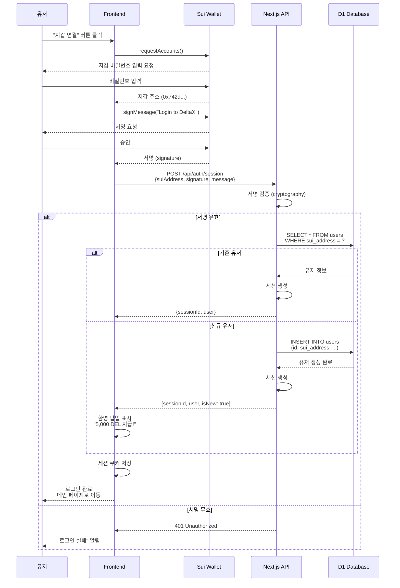
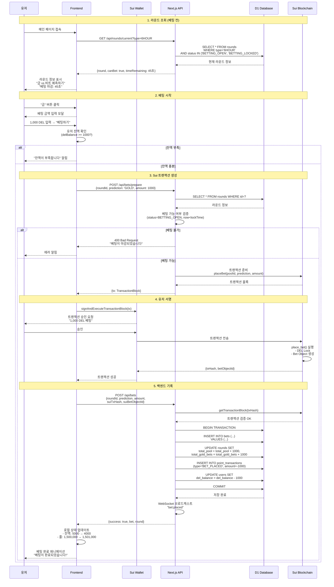
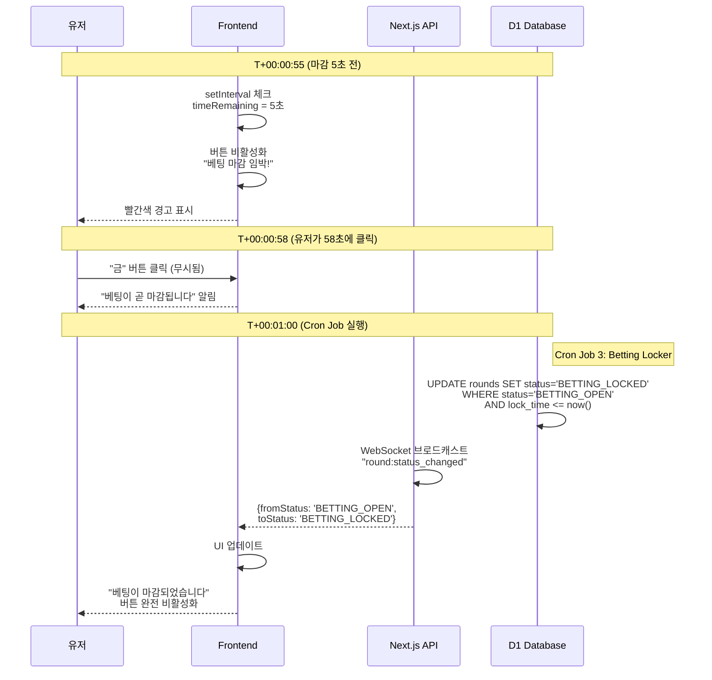
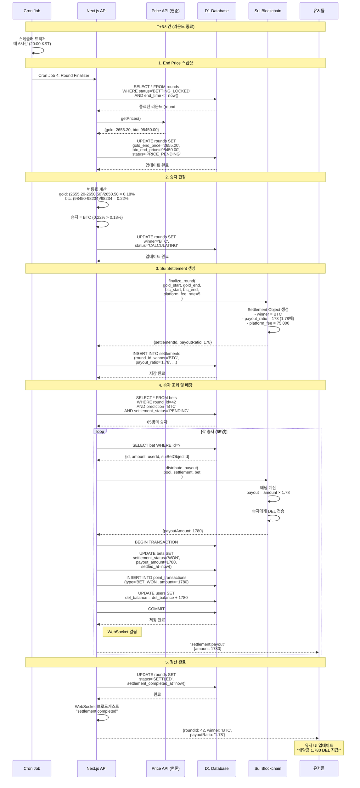
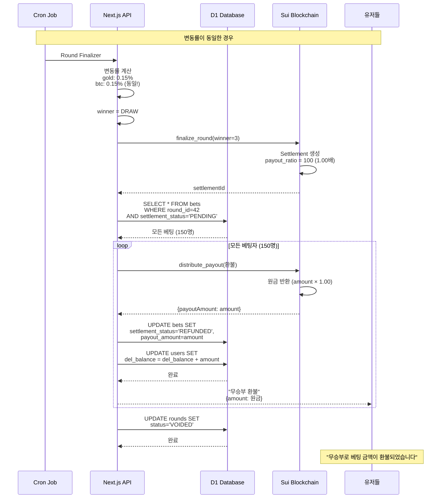
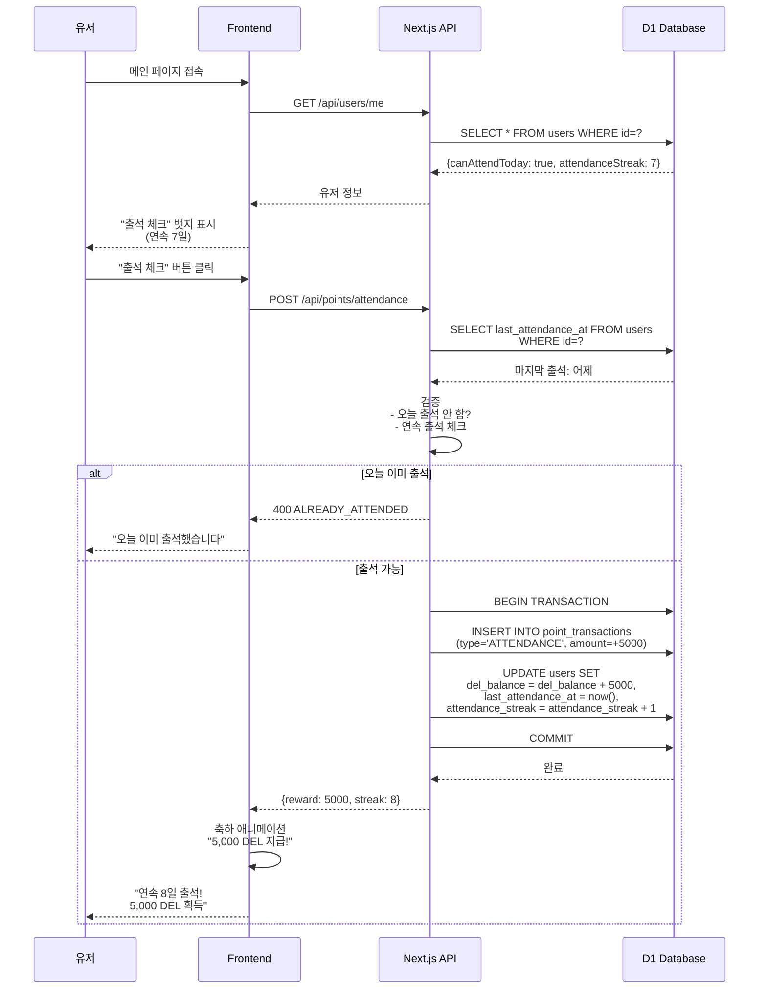
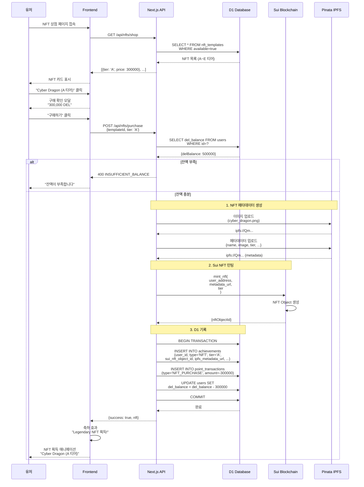
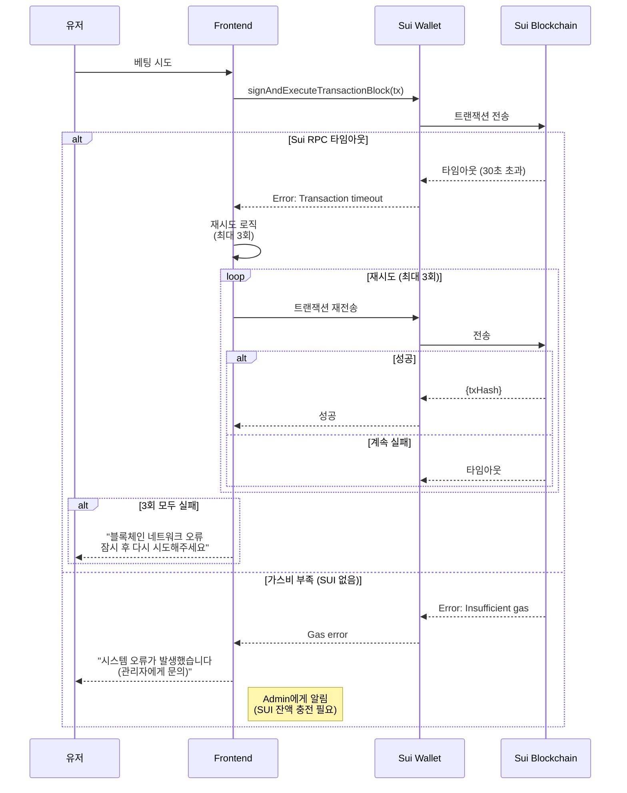
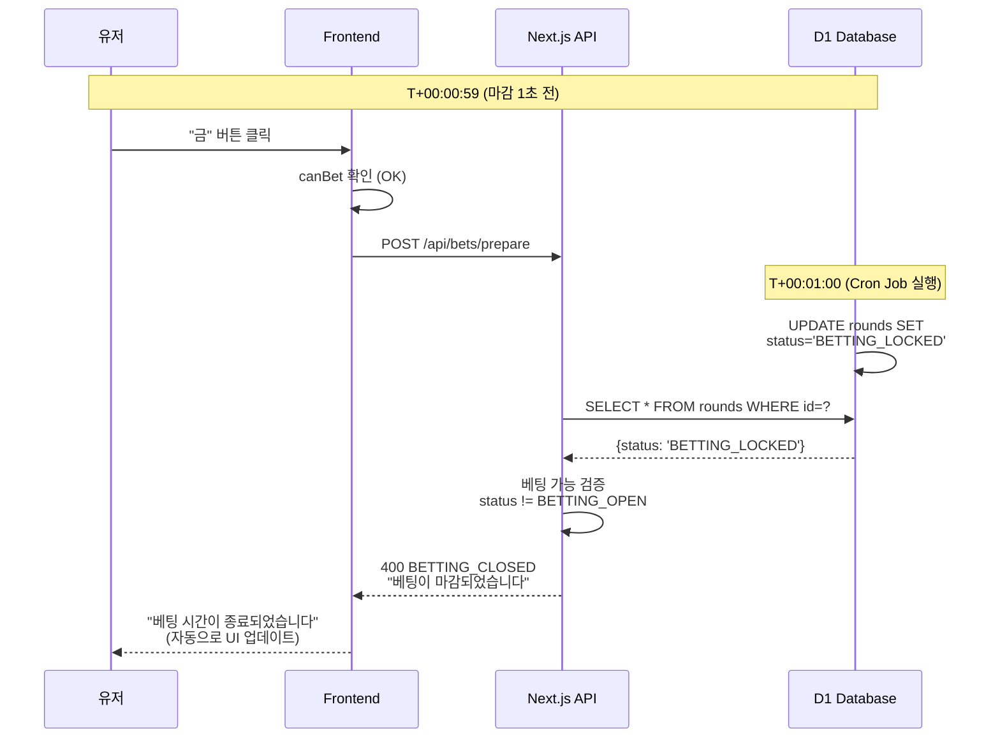
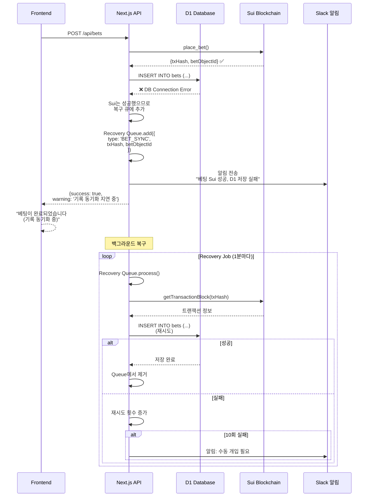

# USER_FLOW.md

deltaX 베팅 시스템의 유저 플로우 시퀀스 다이어그램

---

## 📋 목차

1. [개요](#개요)
2. [회원가입 및 로그인](#회원가입-및-로그인)
3. [베팅 플로우](#베팅-플로우)
4. [정산 플로우](#정산-플로우)
5. [출석 체크](#출석-체크)
6. [NFT 구매](#nft-구매)
7. [에러 시나리오](#에러-시나리오)

---

## 개요

### 플로우 다이어그램 구성

모든 플로우는 다음 액터들 간의 상호작용으로 표현됩니다:

- **유저 (User)**: 실제 사용자
- **프론트엔드 (Frontend)**: React UI
- **Next.js API**: 백엔드 API 서버
- **D1 Database**: Cloudflare D1 (SQLite)
- **Sui Blockchain**: Sui 블록체인
- **Cron Job**: 스케줄러 (라운드 관리)

---

## 회원가입 및 로그인

### Sui 지갑 연동 플로우

**핵심 포인트**
1. 비밀번호 없음 → Sui 지갑 = 로그인
2. 서명 검증으로 소유권 증명
3. 신규 유저 자동 가입 + 초기 보상

---

## 베팅 플로우

### Happy Path (정상 베팅)

**타임라인 예상**
1. 라운드 조회: ~100ms
2. Sui 트랜잭션: ~1-2초 (지갑 서명 포함)
3. 백엔드 기록: ~200ms
4. **총 소요 시간**: ~2-3초

---

### 베팅 마감 직전 시나리오

---

## 정산 플로우

### 라운드 종료 및 배당 지급

**타임라인 예상**
1. End Price 스냅샷: ~1초
2. Sui Settlement 생성: ~2초
3. 배당 전송 (65명): ~65 × 2초 = 2분 10초
4. **총 소요 시간**: ~2-3분

---

### 무승부 (DRAW) 시나리오

---

## 출석 체크

### 일일 출석 보상

---

## NFT 구매

### NFT 상점 플로우 (김영민 담당)

---

## 에러 시나리오

### 1. 네트워크 에러 (Sui 트랜잭션 실패)

### 2. 베팅 마감 후 요청 (Race Condition)

### 3. D1 저장 실패 (Sui 성공 후)

---

## 요약

### 주요 플로우 소요 시간

| 플로우              | 예상 시간     | 병목 지점           |
| ------------------- | ------------- | ------------------- |
| 로그인              | ~2-3초        | Sui 지갑 서명       |
| 베팅 (정상)         | ~2-3초        | Sui 트랜잭션        |
| 정산 (65명 기준)    | ~2-3분        | 배당 전송 (루프)    |
| 출석 체크           | ~500ms        | D1 트랜잭션         |
| NFT 구매            | ~3-4초        | IPFS 업로드 + Sui   |

### UX 최적화 전략

1. **로딩 인디케이터**: 모든 Sui 트랜잭션 시 표시
2. **낙관적 업데이트**: 베팅 후 즉시 UI 업데이트 (백엔드 응답 기다리지 않음)
3. **WebSocket 실시간 업데이트**: 풀 변화, 베팅 현황
4. **에러 복구**: 자동 재시도 + 복구 큐

### 다이어그램 활용

- **개발자**: 구현 시 참고
- **테스터**: 시나리오 기반 테스트
- **PM**: 사용자 경험 이해

---
